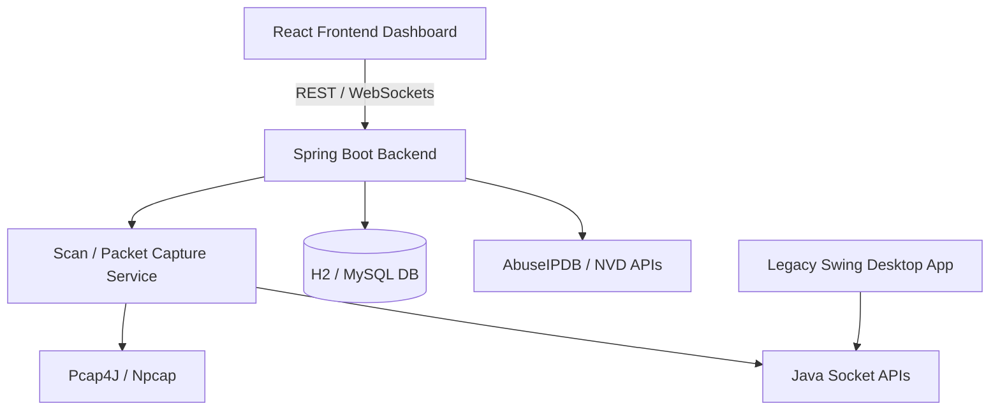

# NSPECT // Network Security Audit Suite

An industry-grade, full-stack **Network Vulnerability Scanner and Mini Intrusion Detection System (IDS)**. NSPECT transitions a basic network diagnostic scanner into a premium security tool capable of concurrent subnet mapping, service banner grabbing, live packet analysis, security risk calculations, real-time alert logs, and compliance reporting.

---

## 🌟 Architecture Overview

The workspace contains three main components:
1. **React Frontend (`/frontend`)**: Cyberpunk-themed dark dashboard with glassmorphic cards, responsive SVG charts, an interactive network topology map, and live IDS feeds.
2. **Spring Boot Backend (`/backend`)**: Java-based REST API providing socket-level scans, JWT-based Role-Based Access Control, history persistence, PDF audits, and Threat Intel integrations.
3. **Legacy Java Swing GUI (`/network-port-scanner`)**: Standalone desktop app optimized with concurrent thread-pooling (`ExecutorService`), EDT-safe progress updates, banner grabbing, and timeout configurations.



---

## 🚀 Quick Start Guide

### Prerequisite: Install Npcap (Required for packet sniffing)
1. Download Npcap from the official website: [npcap.com](https://npcap.com/)
2. During installation, select **"Install Npcap in WinPcap API-compatible mode"**.

---

### Step 1: Start the Spring Boot Backend
1. Navigate to the backend directory:
   ```bash
   cd backend
   ```
2. Compile and run the server using Maven:
   ```bash
   mvn spring-boot:run
   ```
3. The server will run on [http://localhost:8082](http://localhost:8082).
4. **Database Console:** Access the in-memory H2 Console at `http://localhost:8082/h2-console` (Username: `sa`, Password: `password`, JDBC URL: `jdbc:h2:mem:scannerdb`).

---

### Step 2: Start the React Frontend
1. Navigate to the frontend directory:
   ```bash
   cd frontend
   ```
2. Install dependencies (if not already done):
   ```bash
   npm install
   ```
3. Launch the development server:
   ```bash
   npm run dev
   ```
4. Open your browser and navigate to [http://localhost:5173](http://localhost:5173).

---

### Step 3: Run the Legacy Swing GUI (Optional Desktop Client)
1. Navigate to the legacy folder:
   ```bash
   cd network-port-scanner
   ```
2. Compile the Java files:
   ```bash
   javac -cp "lib/*" src/*.java
   ```
3. Run the GUI:
   ```bash
   java -cp "lib/*;src" ScannerGUI
   ```

---

## 🔐 Seeded Accounts (RBAC)

The backend auto-seeds three default accounts upon launch. Log in using these credentials to test role-based privileges:

* 🛡️ **Admin Profile:**
  * **Username:** `admin` | **Password:** `admin123`
  * **Privileges:** Full write, read, scan trigger, PDF export, and setting modifications.
* 🔍 **Analyst Profile:**
  * **Username:** `analyst` | **Password:** `analyst123`
  * **Privileges:** Trigger scanner operations and download PDF reports.
* 👁️ **Viewer Profile:**
  * **Username:** `viewer` | **Password:** `viewer123`
  * **Privileges:** Read-only dashboard access. Scanner triggers and report downloads are locked.

---

## 🛠️ The 18 Integrated Modules

| Module | Feature | Implementation Detail |
| :--- | :--- | :--- |
| **M1** | **Smart Discovery** | Auto-detects local host interfaces and reverse DNS entries. |
| **M2** | **Port Scanner** | High-concurrency port scanning utilizing an optimized Java Executor thread-pool. |
| **M3** | **Banner Analysis** | Actively sends payloads (like HTTP HEAD, SMTP, and FTP HELO) to trigger verbose service banners. |
| **M4** | **Vulnerability Scan** | Identifies risky, unencrypted protocols (FTP, Telnet) and tags outdated versions. |
| **M5** | **CVE Checker** | Maps detected banners (e.g., vsFTPd 2.3.4, OpenSSH 7.2) to known vulnerability disclosures. |
| **M6** | **Packet Sniffer** | Captures live interface traffic and decodes Protocol types, source/destination IPs, and lengths. |
| **M7** | **Mini IDS** | Identifies network attacks (SYN Flood, ARP Spoofing, Brute-Force Logins) in real-time. |
| **M8** | **AI Threat Detection** | Flags packet volume anomalies and flags warning indicators when rates spike. |
| **M9** | **Threat Intelligence** | Connects to external feeds (AbuseIPDB) to score public IPs for spam/malicious records. |
| **M10** | **Risk Calculation** | Computes security scores (0 - 100) based on vulnerability severe ratings and open ports. |
| **M11** | **Cyberpunk Dashboard**| Renders active port graphs, donut breakdown charts, and live ticker logs. |
| **M12** | **Report Generator** | Downloads structured security audit reports in PDF format (supporting full offline PDF generation). |
| **M13** | **History Logger** | Stores scan metrics, discovered services, and historical records to local database logs. |
| **M14** | **Access Control** | Configured with Spring Security + stateless JWT tokens to restrict UI tabs and API endpoints. |
| **M15** | **Live Daemon** | Background scheduler continuously checking network throughput and interface activity. |
| **M16** | **IDS Alert Push** | Triggers visual alarms and warnings upon detecting threshold breaches or malicious IPs. |
| **M17** | **Topology Map** | Graphs network nodes interactively inside an SVG canvas displaying operating system fingerprints on click. |
| **M18** | **Compliance Audit** | Performs automated compliance check reports highlighting violations under PCI-DSS guidelines. |

---

## 🔌 Dynamic API Endpoint Specifications

The Spring Boot backend exposes the following REST APIs to make the React frontend completely dynamic:

* **Subnet Discovery:**
  * `GET /api/devices`: Triggers a concurrent subnet ping scan (`192.168.1.1-254`), decodes network properties, and computes dynamic coordinates for circular network topology plotting.
* **Packet Sniffer:**
  * `GET /api/sniffer/packets`: Retrieves the ring buffer list of last captured/sniffed network packets.
  * `GET /api/sniffer/alerts`: Retrieves active security threat warnings compiled by backend IDS heuristics (e.g., ARP spoofing, TCP SYN flood).
  * `POST /api/sniffer/toggle`: Pauses or resumes the packet capture listener threads on the server.
  * `GET /api/sniffer/status`: Returns the running state (active/paused) of the packet capture listener.
* **Security Scanner & History:**
  * `POST /api/scan?host={host}&startPort={start}&endPort={end}&timeout={timeout}`: Runs socket scanner.
  * `GET /api/history`: Loads scan records saved in database logs.
  * `GET /api/report/pdf?host={host}`: Exports PDF report matching findings.

---

## ⚙️ Configuration & Customization

### Database Swap (H2 to MySQL)
To switch persistence from the default H2 in-memory DB to MySQL:
1. Open `backend/src/main/resources/application.properties`.
2. Comment out the H2 settings (lines 8–18).
3. Uncomment the MySQL configuration section (lines 24–30) and update with your local credentials:
   ```properties
   spring.datasource.url=jdbc:mysql://localhost:3306/scannerdb?useSSL=false
   spring.datasource.username=YOUR_USER
   spring.datasource.password=YOUR_PASSWORD
   ```

### Live Threat Intelligence Lookup (AbuseIPDB API)
To enable live, database-backed Threat Intelligence queries instead of fallback mock simulations:
1. Register for a free API key at [AbuseIPDB](https://www.abuseipdb.com/).
2. Open `backend/src/main/resources/application.properties`.
3. Set your key:
   ```properties
   api.abuseipdb.key=YOUR_ABUSEIPDB_API_KEY
   ```

### 🤖 AI Cybersecurity Assistant
The suite integrates an interactive security assistant. You can query about open ports, protocol threats, or specific CVEs (e.g. "Why is Port 445 dangerous?" or "What is CVE-2011-2523?") to retrieve instant explanations, risk analysis, and copyable terminal mitigation commands (`iptables` blocks, Windows Defender setups, or service upgrades).

---

## 🐳 Docker Deployment Setup

You can containerize and launch the entire stack (backend API, database configuration, and frontend dashboard) with a single command:

1. **Prerequisite:** Make sure Docker and Docker Compose are installed on your machine.
2. **Build and Run:**
   ```bash
   docker-compose up --build
   ```
3. Once running, access:
   - **Frontend Portal:** [http://localhost:80](http://localhost:80)
   - **Backend API:** [http://localhost:8082](http://localhost:8082)

---

## ⚖️ License & Disclaimer
This software is intended **for educational and network defense purposes only**. Do not execute scans or packet analysis against target environments without explicit authorization.

---

## ✍️ About the Author

* **Author:** Anisha Paturi
* **Role:** Computer Science Engineering Student
* **Focus:** Computer Networks, Cyber Security, and Full-Stack Engineering


